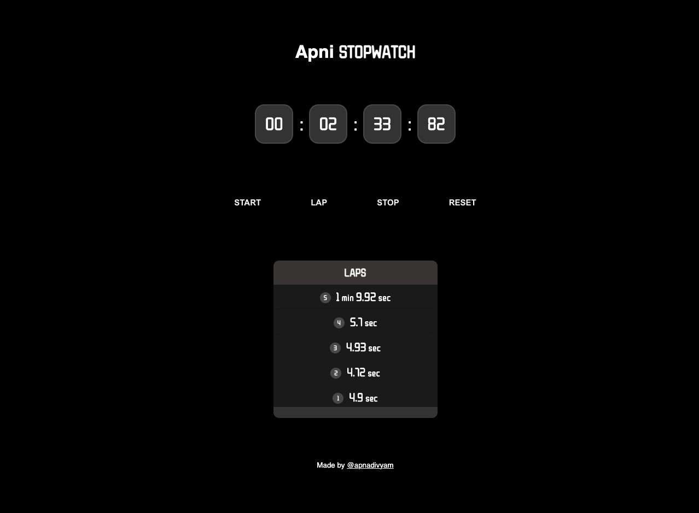

# Apni Stopwatch ⏱️

A simple and stylish stopwatch web app built with **vanilla JavaScript**, HTML, and CSS — no frameworks or libraries.

## ✨ Features

✅ Start, stop, and reset the timer  
✅ Record laps with time history  
✅ Completely Custom CSS  
✅ Responsive design, Intractive UI elements  
✅ Smooth UI with modern fonts and dark theme

## 🛠️ How to Run

1. Clone or download this repository:
   ```bash
   git clone https://github.com/apnadivyam/vanilla-stopwatch.git
   ```
2. Open `index.html` in your browser.
3. Done! 🎉

## 📁 Project Structure

```
.
├── index.html
├── style.css
├── script.js
└── screenshot.png
```

## ⚙️ How It Works

- **index.html** — the main HTML file
- **style.css** — styles for the stopwatch UI
- **script.js** — JavaScript logic for timer, lap tracking, and button controls

## 📸 Screenshot



## 🙌 Credits

Made with ❤️ by [@apnadiyyam](https://x.com/apnadivyam)
